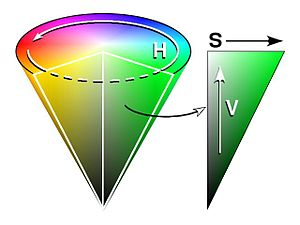

## Project: Search and Sample Return
### Writeup Template: You can use this file as a template for your writeup if you want to submit it as a markdown file, but feel free to use some other method and submit a pdf if you prefer.

---


**The goals / steps of this project are the following:**  

**Training / Calibration**  

* Download the simulator and take data in "Training Mode"
* Test out the functions in the Jupyter Notebook provided
* Add functions to detect obstacles and samples of interest (golden rocks)
* Fill in the `process_image()` function with the appropriate image processing steps (perspective transform, color threshold etc.) to get from raw images to a map.  The `output_image` you create in this step should demonstrate that your mapping pipeline works.
* Use `moviepy` to process the images in your saved dataset with the `process_image()` function.  Include the video you produce as part of your submission.

**Autonomous Navigation / Mapping**

* Fill in the `perception_step()` function within the `perception.py` script with the appropriate image processing functions to create a map and update `Rover()` data (similar to what you did with `process_image()` in the notebook). 
* Fill in the `decision_step()` function within the `decision.py` script with conditional statements that take into consideration the outputs of the `perception_step()` in deciding how to issue throttle, brake and steering commands. 
* Iterate on your perception and decision function until your rover does a reasonable (need to define metric) job of navigating and mapping.  

[//]: # (Image References)

[image1]: ./misc/rover_image.jpg
[image2]: ./calibration_images/example_grid1.jpg
[image3]: ./calibration_images/example_rock1.jpg 

## [Rubric](https://review.udacity.com/#!/rubrics/916/view) Points
### Here I will consider the rubric points individually and describe how I addressed each point in my implementation.  

---
### Writeup / README

#### 1. Provide a Writeup / README that includes all the rubric points and how you addressed each one.  You can submit your writeup as markdown or pdf.  

You're reading it!

### Notebook Analysis
#### 1. Run the functions provided in the notebook on test images (first with the test data provided, next on data you have recorded). Add/modify functions to allow for color selection of obstacles and rock samples.

***Obstacle***

I determined that the obstacle area is the reverse area of the navigable area.
So take a invert area of thresholded navigable area.

```
threshed_obstacle = 1 - threshed_navigable
```

***Rock***

I decided to use HSV color space to thresholding.
I use (20,100,100) to (40,255,255) area to recognize rock.





#### 1. Populate the `process_image()` function with the appropriate analysis steps to map pixels identifying navigable terrain, obstacles and rock samples into a worldmap.  Run `process_image()` on your test data using the `moviepy` functions provided to create video output of your result. 

According to the content of the lecture, Perspective Transform Warp,Color Threshold was performed and the region was extracted.
* Perspective Transform Warp
The source is [[14, 140], [301, 140], [200, 96], [118, 96]].
The destination is derived from image shape.
```
  # 1) Define source and destination points for perspective transform
    dst_size = 5
    bottom_offset = 6
    source = np.float32([[14, 140], [301, 140], [200, 96], [118, 96]])
    destination = np.float32([[img.shape[1] / 2 - dst_size, img.shape[0] - bottom_offset],
                              [img.shape[1] / 2 + dst_size, img.shape[0] - bottom_offset],
                              [img.shape[1] / 2 + dst_size, img.shape[0] - 2 * dst_size - bottom_offset],
                              [img.shape[1] / 2 - dst_size, img.shape[0] - 2 * dst_size - bottom_offset],
                              ])
    
    # 2) Apply perspective transform
    # Let's create more images to add to the mosaic, first a warped image
    warped = perspect_transform(img, source, destination)
```
* Color Threshold
Since color_threshold worked well with default parameters, I tried as it was.
```
# Identify pixels above the threshold
# Threshold of RGB > 160 does a nice job of identifying ground pixels only
def color_thresh(img, rgb_thresh=(160, 160, 160)):
    # Create an array of zeros same xy size as img, but single channel
    color_select = np.zeros_like(img[:,:,0])
    # Require that each pixel be above all three threshold values in RGB
    # above_thresh will now contain a boolean array with "True"
    # where threshold was met
    above_thresh = (img[:,:,0] > rgb_thresh[0]) \
                & (img[:,:,1] > rgb_thresh[1]) \
                & (img[:,:,2] > rgb_thresh[2])
    # Index the array of zeros with the boolean array and set to 1
    color_select[above_thresh] = 1
    # Return the binary image
    return color_select
```

We mapped the acquired region to world coordinates and added it to each color channel.

```
data.worldmap[ypix_world_obs, xpix_world_obs, 0] += 1
    data.worldmap[ypix_world_rock, xpix_world_rock, 1] += 1
    data.worldmap[ypix_world_nav, xpix_world_nav, 2] += 1
```

### Autonomous Navigation and Mapping

#### 1. Fill in the `perception_step()` (at the bottom of the `perception.py` script) and `decision_step()` (in `decision.py`) functions in the autonomous mapping scripts and an explanation is provided in the writeup of how and why these functions were modified as they were.

* perception
The perception step pretty much follows process_image() function in the Jupyter Notebook.
It seems that perspected naviable mapping is too large to mapping worldmap,so I decided to clip image as bellow.
```
image_shape = threshed_navigable.shape
    threshed_navigable[:, 0:np.int(image_shape[1] / 2.5)] = 0
    threshed_navigable[:, -np.int(image_shape[1] / 2.5):] = 0
    threshed_navigable[0:np.int(image_shape[0] / 2)] = 0
``` 
I also restricted the obstacle area to only the visible range as described below.
```
    perspect_area = perspect_transform(np.ones_like(threshed_navigable), source, destination)
    threshed_obstacle[perspect_area == 0] = 0
    threshed_rock = color_thresh_rock(warped_rock)
```

* decision


#### 2. Launching in autonomous mode your rover can navigate and map autonomously.  Explain your results and how you might improve them in your writeup.  


**Note: running the simulator with different choices of resolution and graphics quality may produce different results, particularly on different machines!  Make a note of your simulator settings (resolution and graphics quality set on launch) and frames per second (FPS output to terminal by `drive_rover.py`) in your writeup when you submit the project so your reviewer can reproduce your results.**

Here I'll talk about the approach I took, what techniques I used, what worked and why, where the pipeline might fail and how I might improve it if I were going to pursue this project further.  


